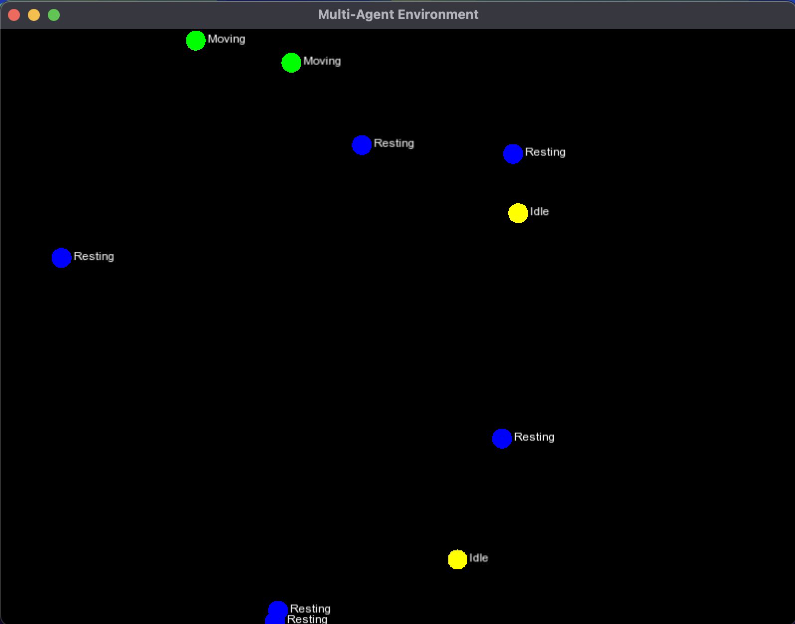

# Multi-Agent Environment in C++ with SFML

This is a simple example of a visual simulation using C++ and SFML, where multiple agents move and change states in a shared environment. Each agent can be in one of three states: **Idle**, **Moving**, or **Resting**, and their color reflects their current state.




---

## 🧰 Requirements

- **C++17 or newer**
- **SFML (Simple and Fast Multimedia Library) version 2.6**
- A **C++ compiler** like `g++`, `clang++`, or an IDE like **Visual Studio**, **CLion**, or **Xcode**
- A font file (e.g. `arial.ttf`) placed in the same directory as the executable

---

## 🛠️ Installation

### On macOS (using Homebrew)

```bash
brew install sfml@2
brew link sfml@2 --force
```

## 🧪 How to Build and Run

### Compile

```bash
g++ main.cpp -o agents -std=c++17 -lsfml-graphics -lsfml-window -lsfml-system
```

### Run
```bash
./agents
```

Agents will appear in the window and randomly change state and move around. Their colors reflect their states:

    🟡 Idle

    🟢 Moving

    🔵 Resting

## 💡 Notes
If you’re using SFML 3.x (development version), this example won't compile as-is — use SFML 2.6 or modify the code for API changes.
If arial.ttf is not available, you can use any .ttf font — just update the filename in main.cpp.

